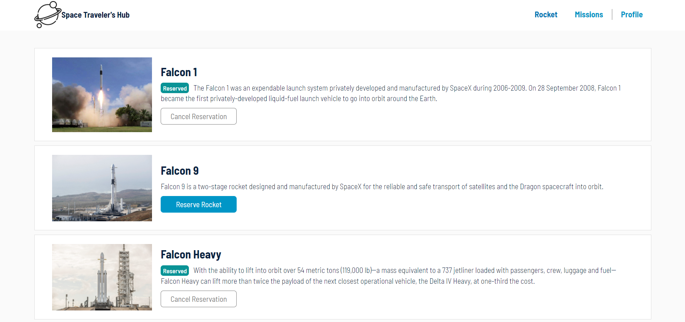

# Project Name

> The project consists of making a connection from the api to our website making reservations of ships and missions, to finally be able to see our reservations directly in the profile section.

## Features

The website displays space rockets and missions from a third-part API:

- Navigate between two pages, rockets, missions, and profile.
- User can reserve and cancel reservation of rockets.
- User can join as active member and cancel them from missions.
- The profile section display the reserved rockets and join missions.
- The website saves and retrieves book information from an API.

## Built With

- Javascript
- React
- Redux
- SASS
- Webpack

## Live Demo (if available)

[Space travel](https://joseheco.github.io/space-travel/)

## Getting Started

To get a local copy up and running follow these simple example steps.

### Prerequisites

- Have git installed on your local computer.

### Install

- Clone this repository to your local computer. Choose the location you prefer.
- Run the command *npm install* to install all project's dependencies.

### Deployment

- Run the command line *npm run start*.
- The project will automatically open the *index.html* file in a browser.

## Authors

👤 **Gabriela Sánchez Espirilla**

- GitHub: [@gabyse1](https://github.com/gabyse1)
- Twitter: [@gabyse0](https://twitter.com/gabyse0)
- LinkedIn: [Gabriela](https://www.linkedin.com/in/gabriela-s%C3%A1nchez-espirilla-83011b225/)

👤 **José Herrera Conislla**

- GitHub: [@joseheco](https://github.com/joseheco)
- Twitter: [@JoseHeco](https://twitter.com/joseheco)
- LinkedIn: [JoseHeco](https://linkedin.com/in/joseherreraco)

## 🤝 Contributing

Contributions, issues, and feature requests are welcome!

Feel free to check the [issues page](../../issues/).

## Show your support

Give a ⭐️ if you like this project!

## 📝 License

This project is [MIT](./MIT.md) licensed.
